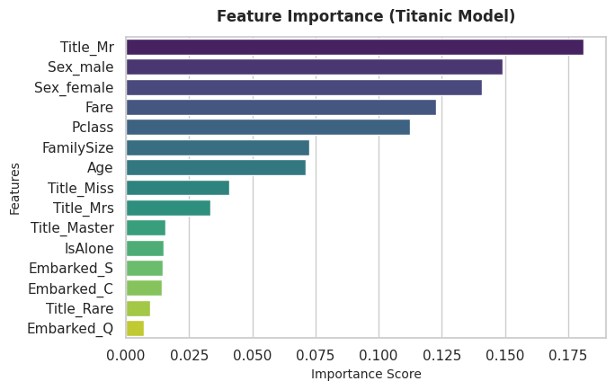
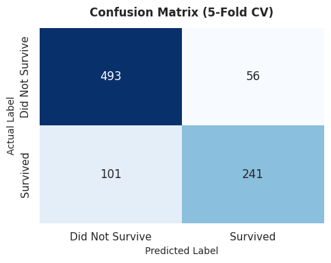

# 🚢 Titanic - Passenger Survival Prediction using Random Forest

An end-to-end Machine Learning pipeline predicting passenger survival on the Titanic dataset from Kaggle, achieving an out-of-fold cross-validation accuracy of **~82.4%** and a public leaderboard evaluation score of **0.77990**.

---

## 📌 Project Overview
The objective of this project is to construct a robust classification model capable of predicting survival outcomes for Titanic passengers. By leveraging exploratory data analysis, domain-aware feature engineering (title extraction, family dynamics), and tree-based ensemble regularization, the pipeline minimizes overfitting while capturing critical non-linear interactions across demographic and socio-economic variables.

---

## 🛠️ Methodology & Technical Pipeline

1. **Exploratory Data Analysis (EDA):**
   - Evaluated survival distribution across passenger classes, gender cohorts, age brackets, and boarding ports.
   - Identified severe demographic skews indicating non-random survival probability (notably prioritizing women and children).

2. **Systematic Imputation & Data Cleaning:**
   - Imputed missing numeric fields (`Age`, `Fare`) utilizing median statistics grouped across socio-economic strata to preserve underlying distributions without introducing leakage.
   - Handled categorical missing values (`Embarked`) using majority class mode imputation.

3. **Advanced Feature Engineering:**
   - **Title Extraction:** Extracted honorary and social titles from passenger names (`Title_Mr`, `Title_Miss`, `Title_Mrs`, `Title_Master`, `Title_Rare`) to capture marital status, age bracket, and social hierarchy.
   - **Family Dynamics:** Derived `FamilySize` (`SibSp` + `Parch` + 1) and a boolean indicator `IsAlone` to identify isolation versus family traveling groups.
   - **One-Hot Encoding:** Applied dummy variable encoding across categorical inputs while aligning column representations across train and test splits.

4. **Model Architecture & Regularization:**
   - Built an ensemble using `RandomForestClassifier(n_estimators=100, max_depth=4, min_samples_leaf=3)`.
   - Constrained maximum tree depth and leaf samples to enforce tree regularization, eliminate leaf-node memorization, and suppress noise variance.

---

## 📊 Model Evaluation & Visual Insights

The model's generalization capabilities were rigorously diagnosed using **5-Fold Cross-Validation (`cross_val_predict`)** across the entire training population (891 passengers).

### 1. Confusion Matrix (5-Fold CV)



* **True Negatives (Did Not Survive - Correct):** 493
* **True Positives (Survived - Correct):** 241
* **False Positives (Type I Error):** 56
* **False Negatives (Type II Error):** 101
* **Out-of-Fold Cross-Validation Accuracy:** **82.38%** ($734 / 891$)

The model demonstrates strong specificity in correctly identifying non-survivors while maintaining high precision across positive survival predictions.

---

### 2. Feature Importance Analysis



By extracting Gini importance scores across all ensemble decision trees, we mapped the relative predictive strength of each feature:

* **Social Title & Gender (`Title_Mr`, `Sex_male`, `Sex_female`):** Emerge as the dominant survival determinants (combined importance $> 45\%$). Engineered titles provided stronger separation than raw gender alone.
* **Socio-Economic Status (`Fare`, `Pclass`):** Higher ticket fares and first-class accommodations directly correlated with proximity to boat decks and higher survival priority.
* **Demographics & Family (`FamilySize`, `Age`):** Moderate family sizes showed higher survival likelihood compared to solo travelers or exceedingly large families.

---

## 💻 Tech Stack & Tools

* **Core Language:** Python
* **Data Processing:** Pandas, NumPy
* **Machine Learning:** Scikit-Learn (`RandomForestClassifier`, `cross_val_predict`, `metrics`)
* **Visualization:** Seaborn, Matplotlib
* **Environment:** Kaggle Notebooks, Git, GitHub

---

## 📂 Repository Structure

```text
├── titanic-survival-prediction-using-random-forest.ipynb   # Complete analysis and training notebook
├── confusion_matrix.png                                     # 5-fold cross-validation confusion matrix
├── feature_importance.png                                   # Ranked feature importance plot
├── submission.csv                                           # Kaggle competition submission file
└── README.md                                                # Technical project documentation
